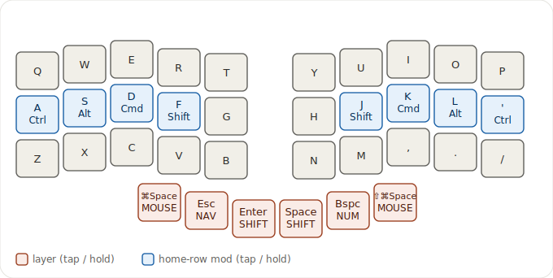
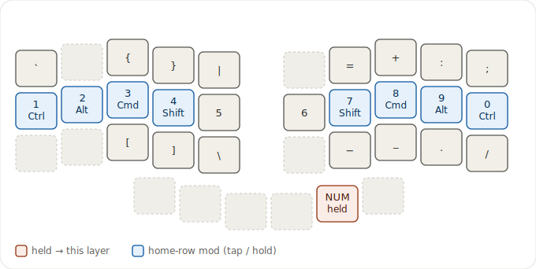
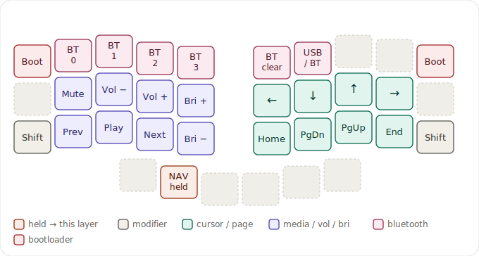
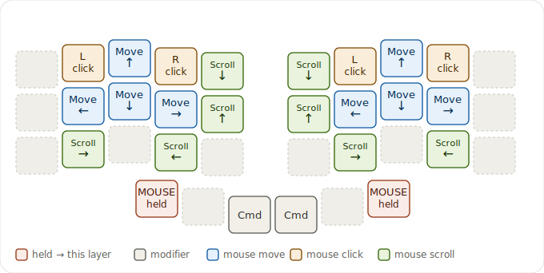
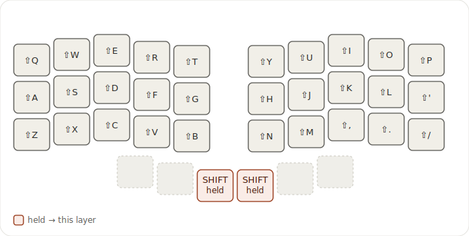

# zmk-config

[ZMK](https://zmk.dev) firmware for a **Corne** (split 36-key) keyboard on **nice!nano v2**.

- Keymap: [`config/corne.keymap`](config/corne.keymap) · build options: [`config/corne.conf`](config/corne.conf)
- QWERTY with CAGS home-row mods, plus number/symbol, navigation/media (+ Bluetooth), mouse, and a one-handed shift layer.
- Flash with the bundled [`flash-corne`](.claude/skills/flash-corne) helper. The diagrams below are generated from the keymap itself by [`keymap-viz`](.claude/skills/keymap-viz).

## Keymap

Hold the thumb key marked **held** to reach each layer (tap it for the letter printed on it). Each key is colored by function — see the legend on every diagram. The diagrams adapt to your GitHub light/dark theme.

### Base — QWERTY + home-row mods


Home row doubles as modifiers when held: `A`/`'`=Ctrl, `S`/`L`=Alt, `D`/`K`=Cmd, `F`/`J`=Shift (positional, so rolls stay taps). The six thumbs are layer-taps.

### Number / symbol — hold right `Bspc`


### Navigation / media + Bluetooth — hold left `Esc`


Top row: bootloader at both outer corners, and Bluetooth — `BT_SEL 0`–`3` on `W`/`E`/`R`/`T`, `BT_CLR` next to them, and `OUT_TOG` (toggle USB ↔ Bluetooth output) beside that.

### Mouse — hold either outer thumb


### Shift — hold `Enter` / `Space`


Same-side shifted letters, so one hand can capitalize while the other holds the thumb.

## Regenerate the diagrams

After editing `config/corne.keymap`, rebuild the SVGs:

```sh
for L in BASE NUM NAV MOUSE SHIFT; do
  python3 .claude/skills/keymap-viz/render.py --standalone "$L" \
    > "keymap/$(echo "$L" | tr '[:upper:]' '[:lower:]').svg"
done
```

`render.py --list` shows the layers; drop `--standalone` to emit the claude.ai widget variant.
